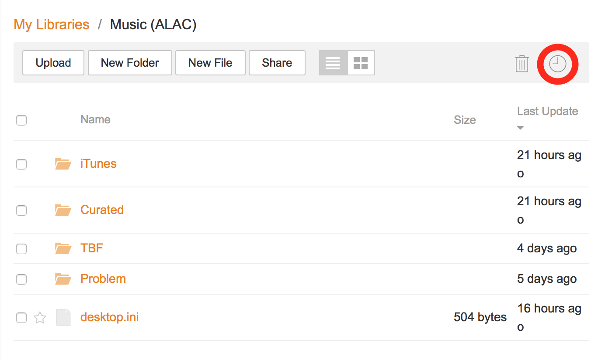
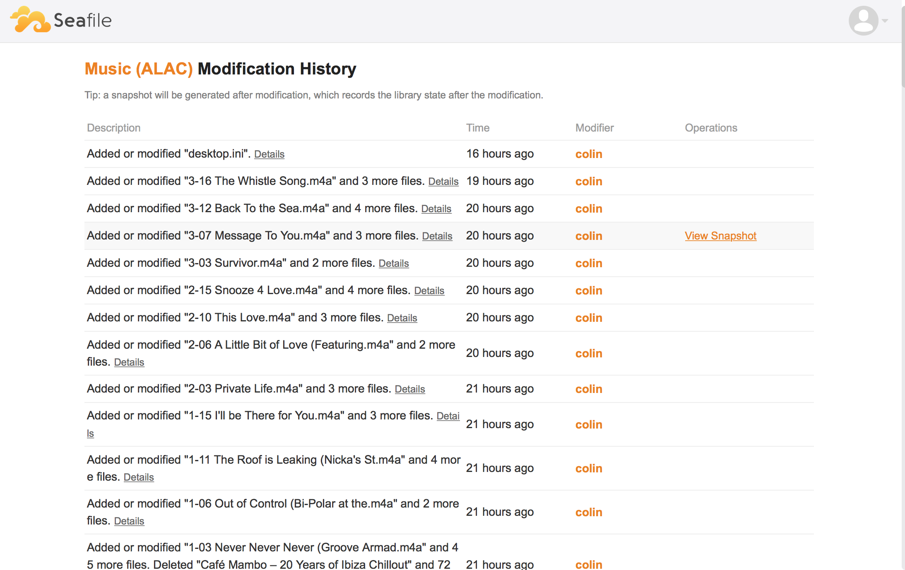
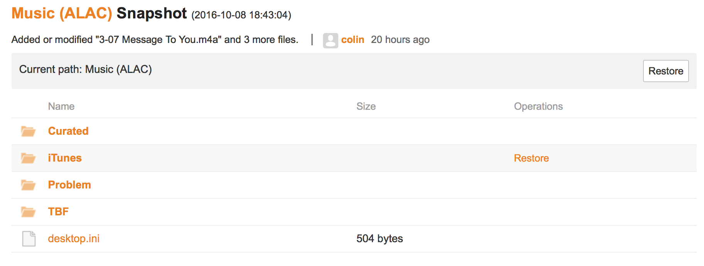
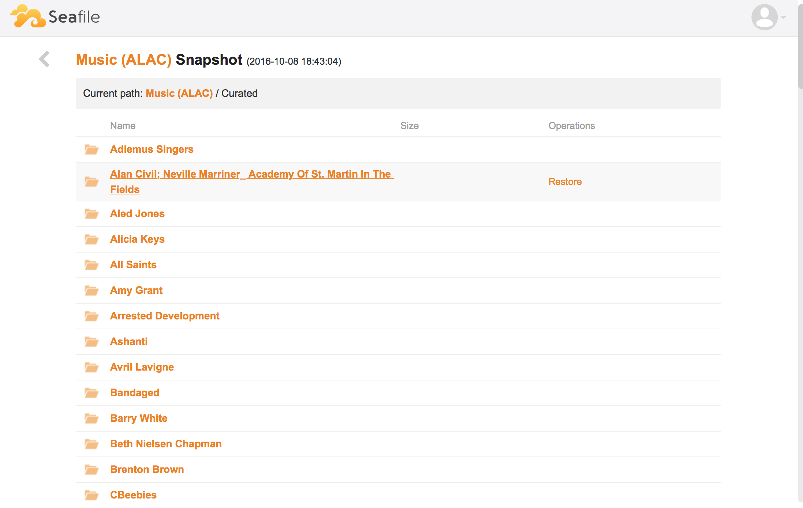
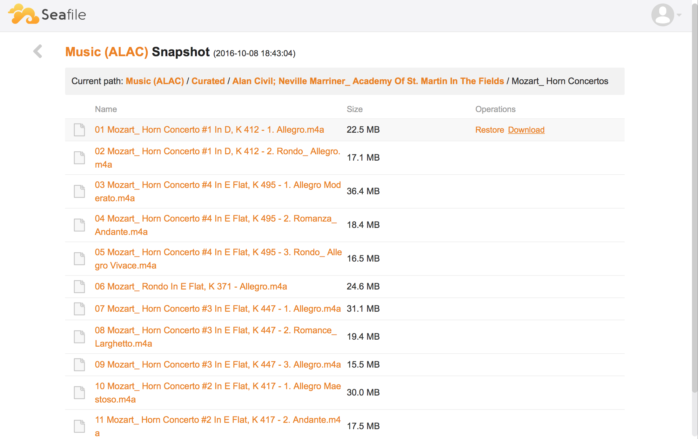

(_NOTE: updated to include images_)

Another fly-by post.

[Seafile](https://www.seafile.com/en/home/) has a really neat 'history' browser - on the web site you will see a little clock icon when viewing a library. If you click this you can navigate to a point-in-time and then either restore the entire library, a folder or a file from that snapshot.

For example, from the list of libraries:

pick a library:

click on the history icon:

choose a snapshot:

navigate as you wish:

then either restore or download the file:

Neat huh - unfortunately it is only on the web, not the local sync client - I wonder if the client doesn't have all the required meta-data.

It is also blindingly quick.

I achieved a very similar thing at work using event-streams - the 'historical view' was literally just a fold over all events up to that point in time - but that is going to have to wait for another day :-).
