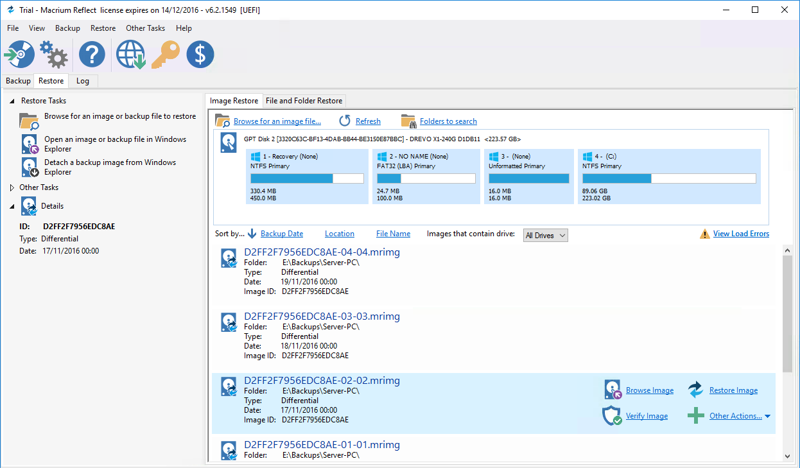
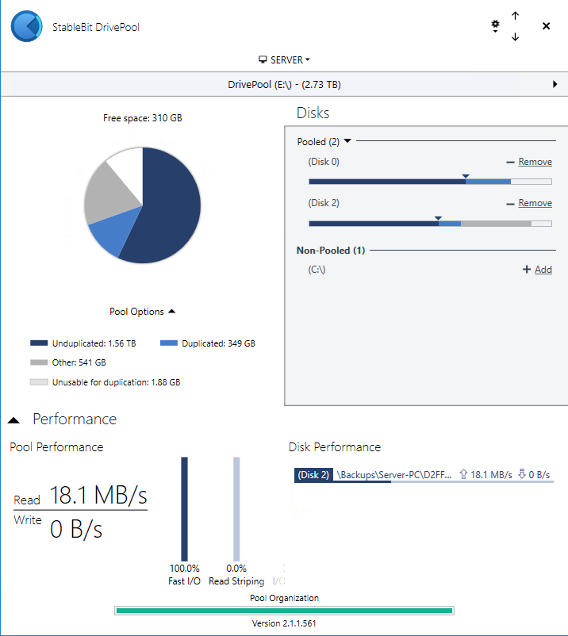
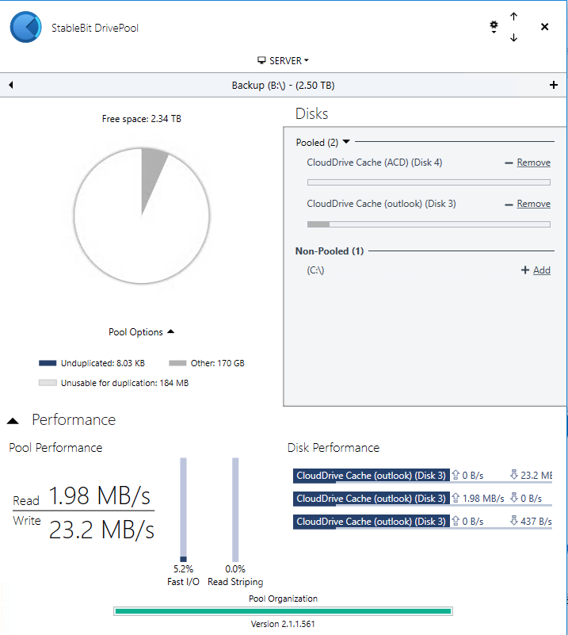
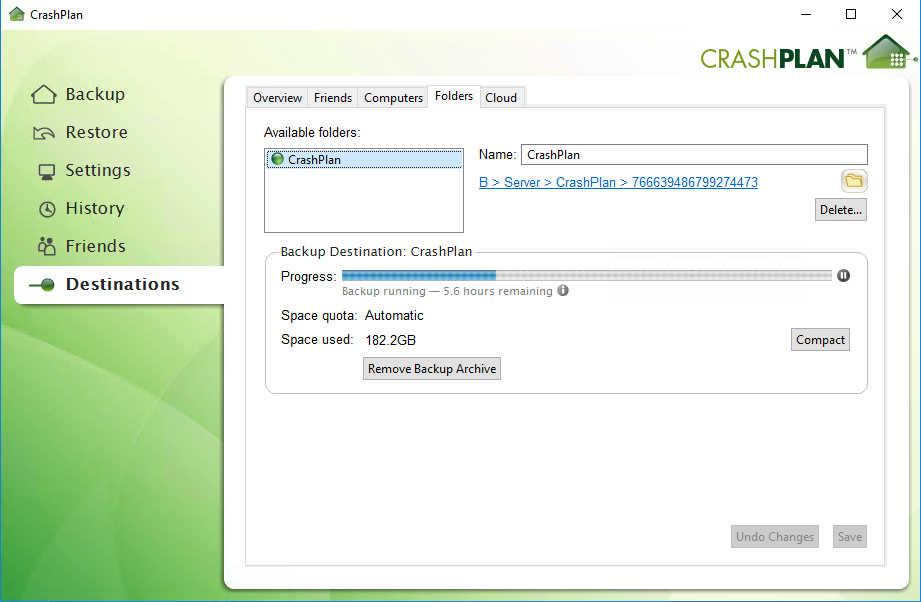
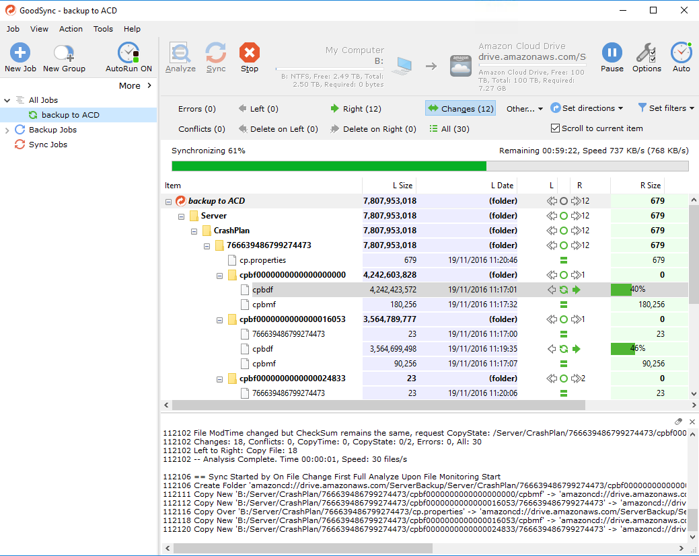

Fun with [NAS's](https://en.wikipedia.org/wiki/Network-attached_storage). If you find that a contradiction in terms then you might not be the right audience for this post - all the best :-).

I have about 2TB of data that I need to maintain. Some of it is (legally owned) media, some of it are documents, photos, machine backups etc.

Having managed a bunch of IT infrastructure (why do people assume Software Engineers know the first thing about computers?!) I am now utterly paranoid about losing data. The very first question in my head when thinking about systems is "what happens when it all goes wrong". Not _if_, but _when_.

There are a whole bunch of NASes out there, but to be blunt, as soon as you want a "decent" one with a decent CPU the price sky rockets.

## RAID to the rescue - only not really

Also, they typically only use the standard RAID profiles which are block based. This means if you lose a drive then sure, you might be able to rebuild the entire array, but the files on disk will be unintelligible outside of that array. If the hardware between you and the disks fails, e.g. the hardware controller then....

There is also a well established theory that given the size of the disks we can get nowadays, there is a significant chance that _another_ disk in the RAID array will fail before the RAID has rebuilt. This gets more likely the more disks you have.

The other design flaw with typical RAID implementations is that they assume homogeneous disks, specifically they assume the disks are the same size. If they aren't then it will only use the smallest disk size. A RAID with a 250GB disk and 1TB disk will only use 250GB from each disk.

So, RAID isn't my ideal go-to anymore.

## File based solutions

RAID works by splitting everything into blocks and distributing those blocks around the disks. Wouldn't it be great if there was another solution which treated your _files_ as atomic? Redundancy at a _file_ level?

The primary benefit is obvious: if a disk fails _the files on every other disk are still accessible_. The main downside is that reads aren't spread across the pool but are sourced from the single disk that the file resides on.

The other benefit is that the major provides of files-based solutions support heterogeneous disks, specifically they will use all of the disk space in each disk even if they aren't the same size.

This makes a wonderful upgrade strategy, simply add a larger disk and let the pool of disks work itself out. (I will explain later how this can work).

## File based NAS

So you can configure a NAS to use [JBOD](https://en.wikipedia.org/wiki/Non-RAID_drive_architectures), and then run a software file-based solution on top of that. But, but, but, what's the point? Most people buy a NAS for the inherent safety, which a JBOD has none of. If you have to run another computer as well then why bother with the NAS?

## NAS, no thanks

So, given I have to run a machine anyway to manage the JBOD I didn't bother with a NAS. I have a spare desktop running [plex](https://plex.tv) so I simply stuck a bunch of disks in the 'server', configure a software based solution called [DrivePool](https://stablebit.com/DrivePool) and off I go.

## Drivepool

So Drivepool, which I _highly_ recommend (no affiliation) creates a 'pool' which is exposed as a single drive letter in Windows. You can add as many disks of different sizes as you like and the pool grows automatically.

Well, the neat thing is that the pool can be configured with internal redundancy such that any file is written to at least N _other_ disks. In addition, when reading, the pool is clever enough to read from each copy in parallel to speed things up.

The special sauce here is that their companion product [Scanner](https://stablebit.com/Scanner) monitors the health (through [S.M.A.R.T](https://en.wikipedia.org/wiki/S.M.A.R.T.) attributes) of your disks and if a disk starts to fail then it will automatically move files off that drive onto another healthy drive. In the background, automatically.

Alternatively, you can configure the pool to only allow duplicates on 'failing' disks.

What happens when the disk fails? If you have redundancy then literally just pull that thing out (shutting down your machine first if your hardware doesn't support hot plugging). Drivepool will notice and immediately start duplicating any files that are now unduplicated.

Adding a new disk? Just plug it in, add it to the pool and Drivepool will rebalance the pool.

It really is quite special.

## Backups

The third companion tool from Stablebit is [CloudDrive](https://stablebit.com/CloudDrive). This is a 'disk' that is backed by a cloud provider (OneDrive, DropBox etc.). You create a new drive and simply link it to a cloud provider. Multiple disks can be backed by the same cloud provider. Each disk is backed by a local cache which can be as big or small as you like.

DrivePool doesn't copy the file as-is, it breaks it down into chunks of, say, 10MB (which can be configured) and transparently uploads your files in these chunks.

If you have Office365 personal then you have 5 separate 1TB onedrive accounts just waiting to be full. Create 5 separate CloudDrives and then combine them all into a single DrivePool.

Oh, I didn't mention that? Yep - the drives created by DrivePool are just like any other drive and can be added into an existing pool or you can create a new pool just for your cloud drives. Your call.

## v1 - my initial solution

My first solution looks like this:

- a "main" drivepool with a bunch of disks
- 5 CloudDrives for each member of my Office365 family. Each CloudDrive has a 1TB cache so my really slow upload speed doesn't impact my write speed.
- a single "backup" drivepool backed by those cloud drives
- crashplan backing up my "main" drivepool to my "backup" drivepool

And it works amazingly well.

Except, well, I was a bit nervous of having to cobble together those separate CloudDrives if anything went wrong, and CloudDrive is still a beta product (although it has worked flawlessly for me).

## v2

I no longer use CloudDrive, simply because CrashPlan already encrypts everything, admittedly it does kick out 4GB blocks which is a risk uploading, but from what I can see, once something is uploaded it is never changed so no re-uploading.

Now, I simply have two pools with CrashPlan backing up from the main to the backup. I then have [GoodSync](https://www.goodsync.com) backing up the backup pool to my Unlimited Amazon Cloud.

## Alternatives

I could have created a single cloud drive backed by Amazon Unlimited, added that to my 'main' drive pool, configured the pool to be redundant and marked only the cloud drive to store only duplicates.

This isn't a backup as such, it is mirroring to the cloud, but it does mean everything is duplicated locally and remotely.

The other flaw with this is the fact that Amazon Cloud Drive is still an experimental provider for CloudDrive. Stablebit's [forum](http://community.covecube.com/index.php?/topic/1588-amazon-cloud-drive-why-is-it-not-supported/) has more info.

This, and my other two versions require at least twice as much disk space as the size of the main pool. But hey, that's what redundancy requires and I am fine with that.

## Other considerations

Any solution that isn't writing directly to the cloud has a window of opportunity for the cloud version to be out of sync with the local version. This means CrashPlan might locally have completed the local backup, goodsync is halfway through uploading the data and BOOM, the computer dies. How likely is it that the cloud version will be usable by CrashPlan?

Quite likely actually :-) given CrashPlan's strategy of append-only. **NONE OF THIS IS TESTED SO DON'T BELIEVE A WORD OF IT**.

## Why not just use CrashPlan's Cloud

I like the idea of a local copy of CrashPlan for speedier recovery. I did start out with CrashPlan but their upload speed started out fine and then hovered around 10KB - yeah. Nope.

## ZFS

How can I not consider ZFS? Well, ZFS absolutely rocks and I was really tempted by the inbuilt snapshot facility. Consider it taking a nightly snapshot and then sharing those snapshots over a SAMBA share. Lovely.

But, it won't let you just throw a new disk in a pool as it expects homogeneous disks. It also wants slightly more serious hardware than I had. But yeah, it is excellent.

## Unraid

I did use [Unraid](https://lime-technology.com) and it is _amazing_. It runs off a USB key and is a Linux distro (Slackware?) which supports file-backed heterogeneous pools. Redundancy is done through a separate parity disk(s).

It also understands dockers so has a whole bunch of plugins. I used it for a couple of weeks and plex and crashplan worked perfectly fine.

Why did I switch?

Virtual machines use KVM and I experienced a bunch of VM crashes on my Windows 10 VM. I also didn't like the fact it wouldn't auto-balance or duplicate amongst disks. So if I had 1 TB disk that was full and I added another 1TB disk, it wouldn't distribute the load automatically.

I was also a little uncomfortably with the obsession with gaming - I want a NAS, not a gaming rig ;-).

## Windows Storage Spaces

I considered this for a few minutes but googling around showed a whole bunch of horror stories. It is also block based which isn't ideal.

## SnapRaid

[SnapRAID](http://www.snapraid.it) is probably the worst named piece of software ;-). It calculates parity across a filesystem and has nothing to do with RAID, other than most RAIDs use parity.

I know a bunch of people run SnapRAID across their DrivePool pool. Given the CrashPlan backup I never saw the point.

## Odrive

[Odrive](https://www.odrive.com) lets you sync locally, but the free version forces you into a weird hierarchy where each cloud provider account is a separate directory.

Sure, it isn't that horrendous, and the paid version would let you sync folders outside the 'odrive folder' but it is _ridiculously_ expensive for what it is.

## rclone

[rclone](http://rclone.org) is brilliant, and is exactly the software I wanted to use, but without a GUI I am now too lazy :-). I do use rclone to backup all of work's servers, but for my time at home, if I wanted to drop down to the CLI I would use Linux.

## Macrium

[Macrium](http://www.macrium.com/reflectfree.aspx) isn't a part of the storage puzzle but it does play a heavy part of my backup solution. It is absolutely great (UI sucks a bit) as an imaging solution. I have it installed on all of the household Window PCs and it nightly images using a Full/Differential strategy.

Where does it store the images? Well, on the "main" drivepool of course :-).

Oh, and it is free.

## Future

When CloudDrive matures out of beta and has first class support for Amazon Cloud Drive I may well drop GoodSync and have my "backup" pool backed up with a single CloudDrive linked to ACD.

Alternatively, now that Amazon Cloud Drive _does_ folder syncing, when/if it ever allows you to choose the folder you want to sync then I might have it sync to my "backup" pool.

## Summary

If you have a single machine and simply need a backup, go grab CrashPlan or BackBlaze. If you have a network of machines and want to back them up and aren't paranoid then go grab a (at least RAID1) NAS.

However, if you want more control then I recommend you take a look at the [DrivePool, Scanner and CloudDrive bundle](https://stablebit.com/Buy/CloudDrive). It is only ~$59 for a perpetual lifetime license.

## Pretty pictures

- Macrium
  
- the "main" pool
  
- the "backup" pool
  
- CrashPlan backing up to my local "backup" CrashPlan folder
  
- GoodSync mirroring my "backup" pool to Amazon Cloud Drive
  
