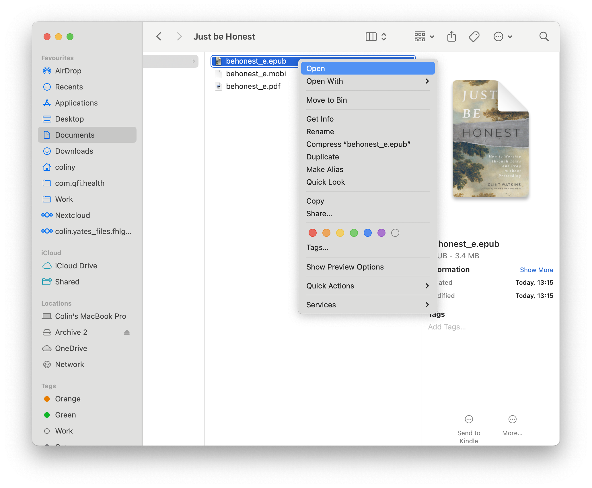
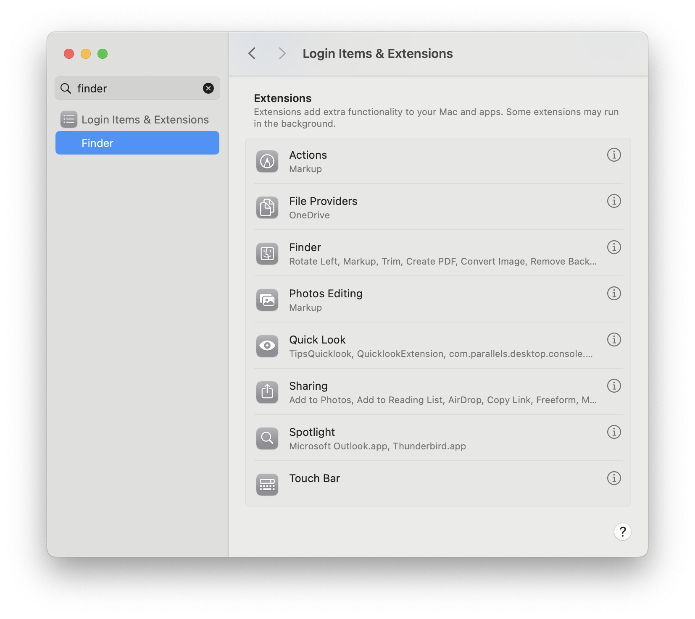
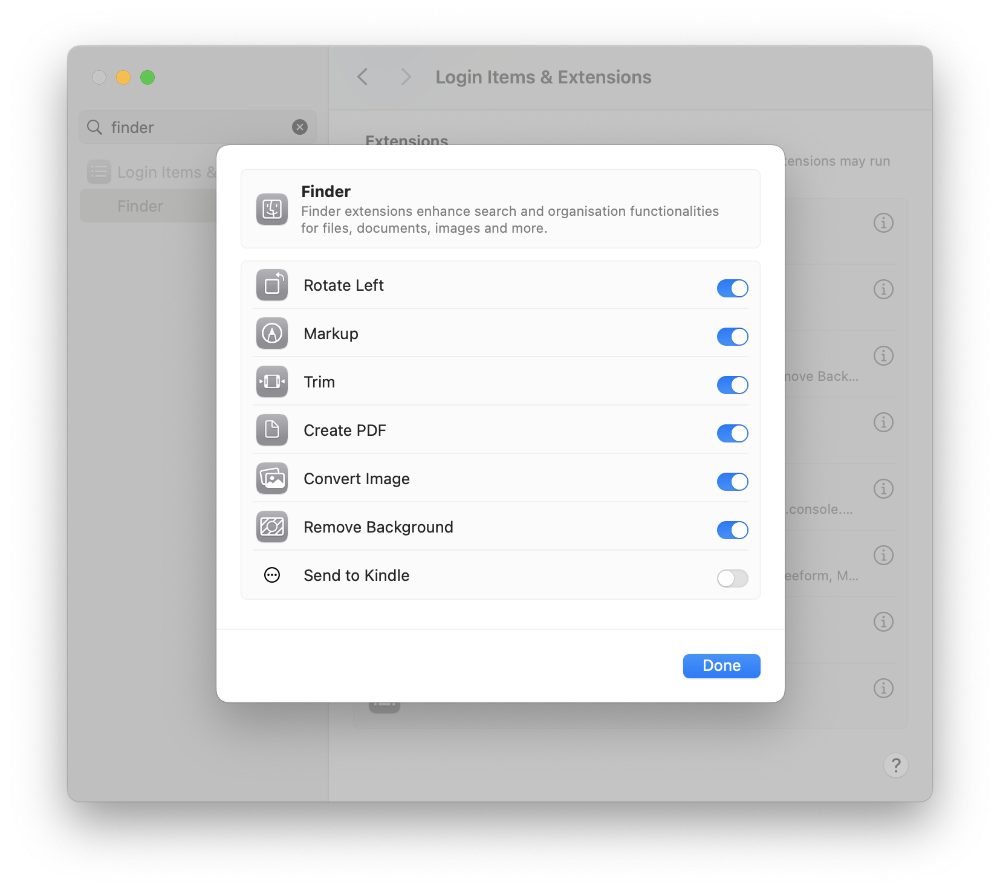
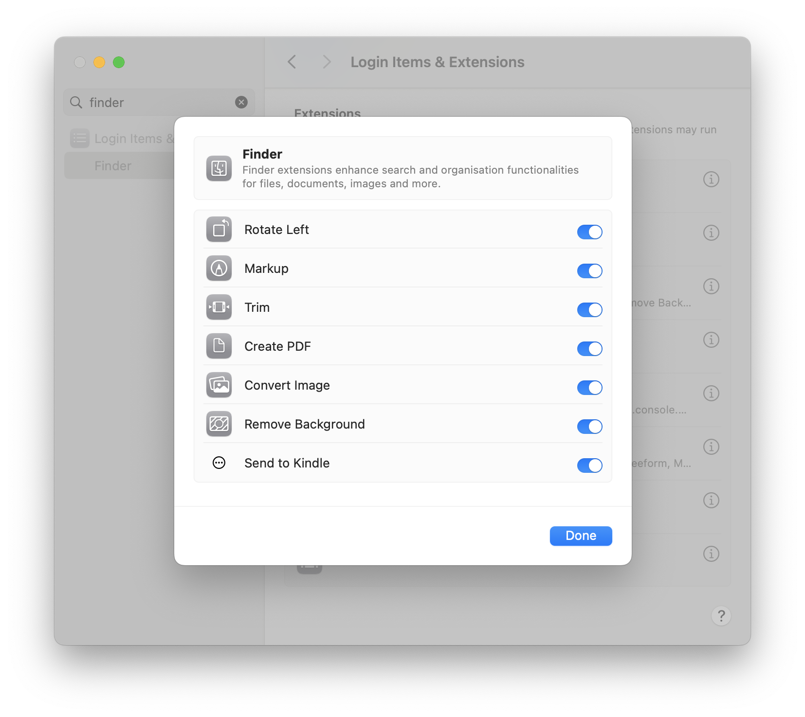
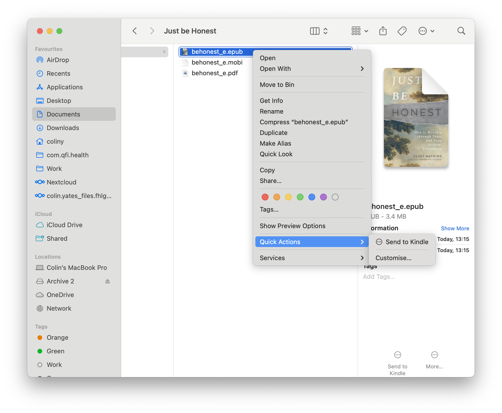
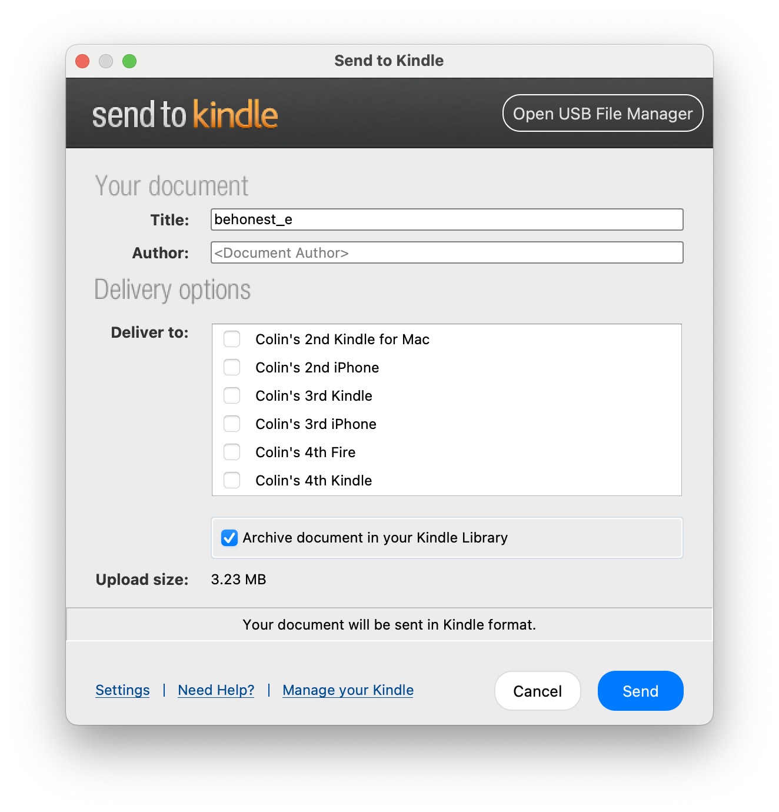

So I wanted to send a recent book I'd purchased (https://www.thegoodbook.co.uk/just-be-honest) to the Kindle from my macbook.

I hadn't _quite_ realised how complicated it could be - sigh.

## Native Kindle App

"Install Kindle" I thought - surely they must have a way? Nope - logged in and was greeted with a very elegant and clean UI. However, after checking every menu in the app, checking system settings etc., nope, no option to send a book.

And no, dragging the `book.epub` from Finder directly onto the Kindle App didn't work.

And no, right clicking on the `book.epub` in Finder didn't show the promised "Send to Kindle" icon either.

## Check the webz

"Search the internetz". They all promised a funky "Send to Kindle" option when right clicking in Finder. But Nope, following the instructions to enable it in system settings didn't work (they've all changed).

## Check Amazon's help

Turns out, there is a specific [Send to kindle](https://www.amazon.co.uk/sendtokindle) set of help pages, and there is a [dedicated](https://www.amazon.co.uk/sendtokindle/mac) app for sending a doc to Kindle.

Great - downloaded, installed, opened the app, signed in, [restarted Finder](https://macpaw.com/how-to/relaunch-finder-mac) and right clicked on the `book.epub`....and nothing. The promised "Send to Kindle was nowhere to be found:

## The magic beans

Turns out I had to enable it in the Finder extensions, which itself is a trial:

Search for Finder in System Settings:

Click on Finder (i):

Enable send to kindle:

Right click and finally! - Huh!? Still no option:

Turns out you need to check "System Options"!:

Click on it and the magic happens:

## Summary

I'm disappointed. Macs used to be expensive, but "they just worked". Booo. Now, [get off my lawn](https://en.wikipedia.org/wiki/You_kids_get_off_my_lawn!)!
