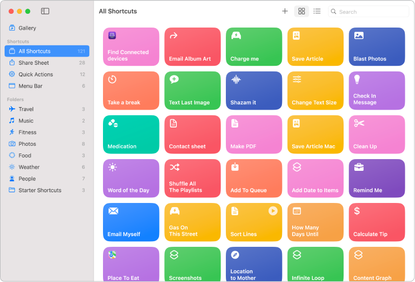

_**DISCLAIMER: It's entirely possible that some of these pain points are due to me not being idiomatic!**_

So Apple Shortcuts ([mac](https://support.apple.com/en-gb/guide/shortcuts/welcome/mac) and [iOS](https://support.apple.com/en-gb/guide/shortcuts-mac/welcome/ios)) has the potential to be **amazing**. It promises a simple drag-n-drop UI to controlling your apple device.

NOTE: Product Owners - please choose names carefully - searching for "Apple Shortcuts" brings up a gazillion matches for _keyboard shortcuts_ and not the actual _tool_ Apple Shortcuts.

Unfortunately it just has a bunch of silly things to trip over.

My first [shortcut to create a blog post](https://www.icloud.com/shortcuts/174b88563a0a458aaa907d9ffd59242f) went well and worked well. Great stuff.

Then things went a little down hill...

## Confirmations

### Accessing Safari web pages

My second shortcut was to [export the current Safari web page to Apple Notes as a PDF](https://www.icloud.com/shortcuts/26c2c0be5df8414193715e391ce81086). Unfortunately, whilst this works ok-ish, it requires confirmation on _every_ new page that it is run on. And not just one - a bunch of confirmations.

For example, I found https://matthewcassinelli.com/sirishortcuts/ and wanted to bookmark it to Apple Notes.

Great - start the bookmark shortcut:

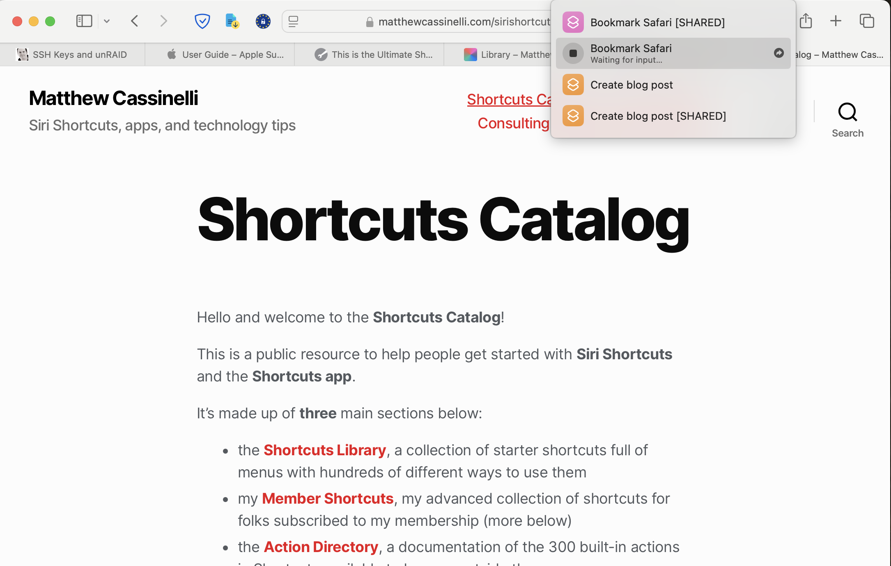

First confirmation:

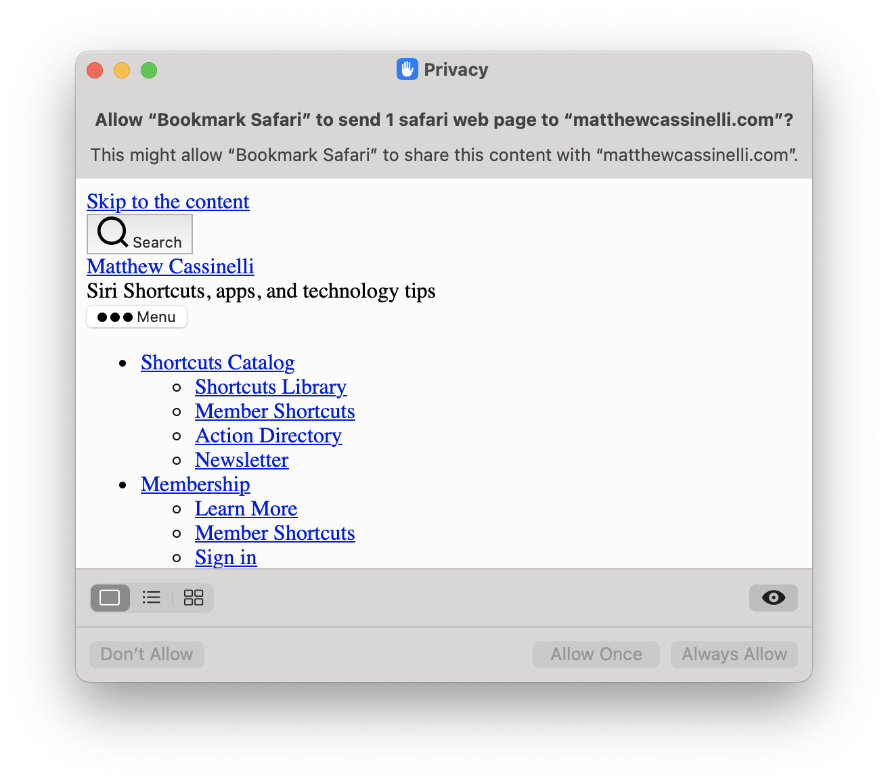

Click "Allow Always":

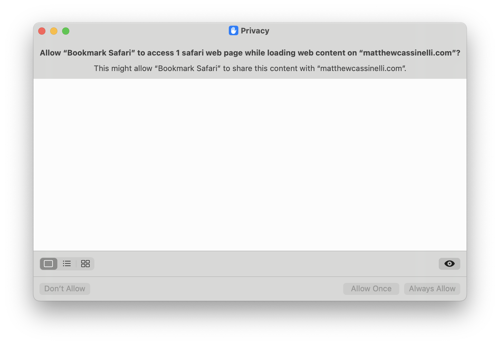

and finally the note is completed:

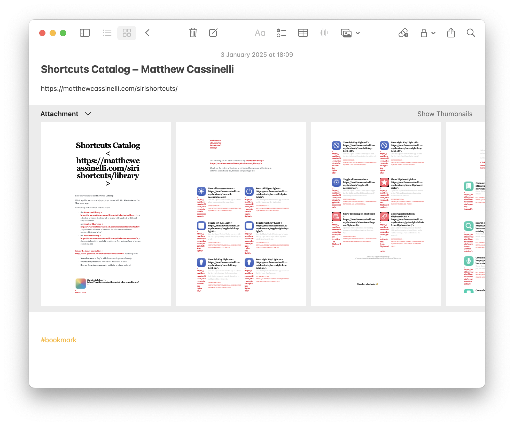

(NOTE: the _actual_ Shortcut I used has been slightly modified to grab the Safari URL and paste that in. _That_ was more painful than it should have been too!)

Shortcuts do actually have permissions but they aren't great either...

## Permissions

The shortcut to capture the Safari page requires confirmation for each and every new page. How are these recorded in the Shortcut? Guess:

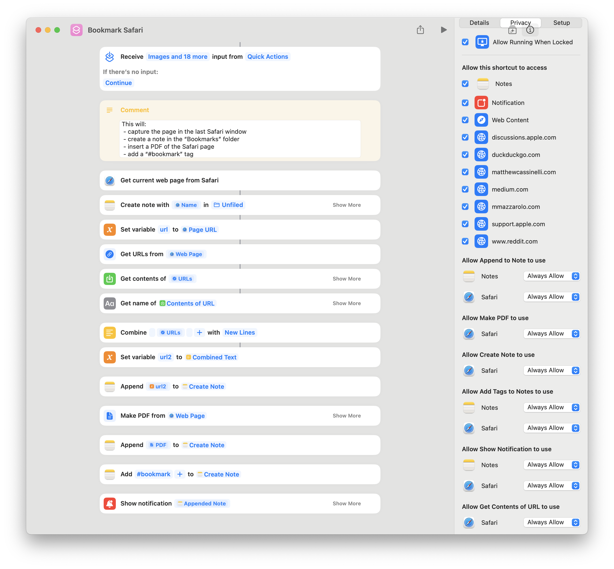

Yeah. That's an awful UI _and_ there is no global "it's fine - just allow Shortcuts to access all of Safari's pages". There is something _that sounds like it does that_, but it doesn't do what you think.

### Archiving Shortcuts

Because I'm paranoid about backups (even if I've managed to lose _more_ data implementing a backup strategy than I've lost to actual hardware failure ;-)) the first thing I do is try and get hold of the underlying data.

My third Shortcut was to [copy the Shortcuts](https://www.icloud.com/shortcuts/fd22fda3b2174378a353167d0ee151f9) somewhere outside of the Apple Walled Garden, and it is actually trivially easy:

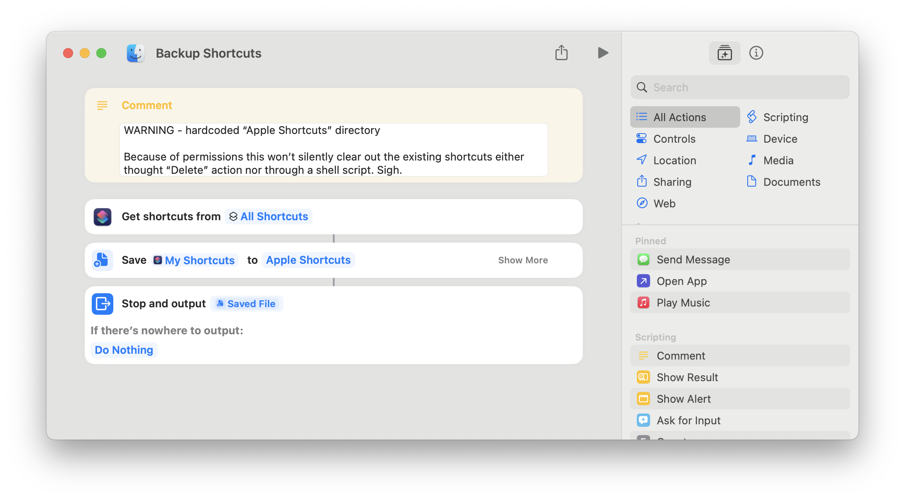

Except the first time you run it you need to _manually_ confirm permission to allow the shortcut to access all the other Shortcuts. **And you can't turn this off**. Add a new Shortcut? New confirmation needed.

There goes any hope of using the `shortcuts` command as part of my backup scripts (using the excellent https://www.arqbackup.com BTW).

The second thing I wanted to do was delete any copies of the Shortcuts left over from previous runs. There's an Action for that, but guess what.... yep, manual confirmation (for deleting the files) again.

## Terrible UI

### Renaming a shortcut

Think you can simply click on the Name in the shortcuts editor? Nope. Too easy:

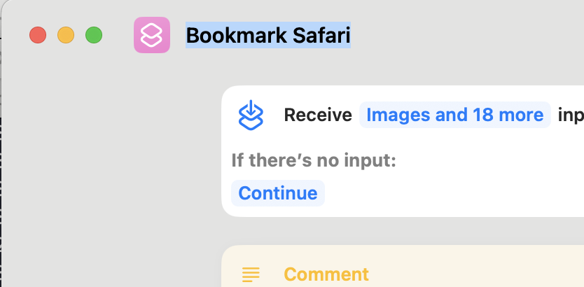

Maybe in the "Home page" you can simply "long press" on it, like you can do elsewhere. In Finder for example:

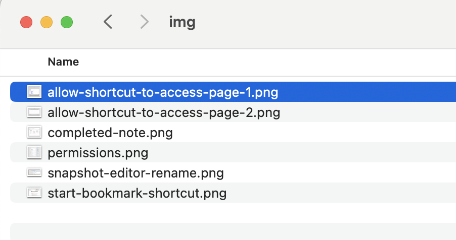

wait long enough so it doesn't interpret it as a double click and then click again:

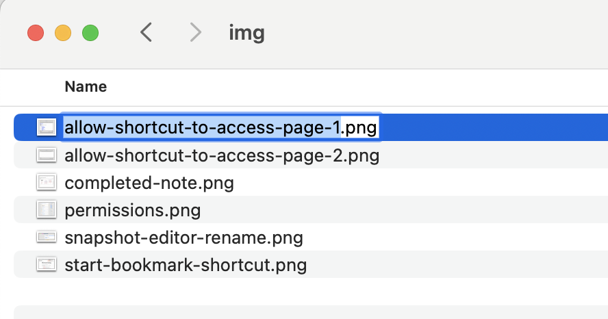

But no. That does nothing in the Shortcuts home page:

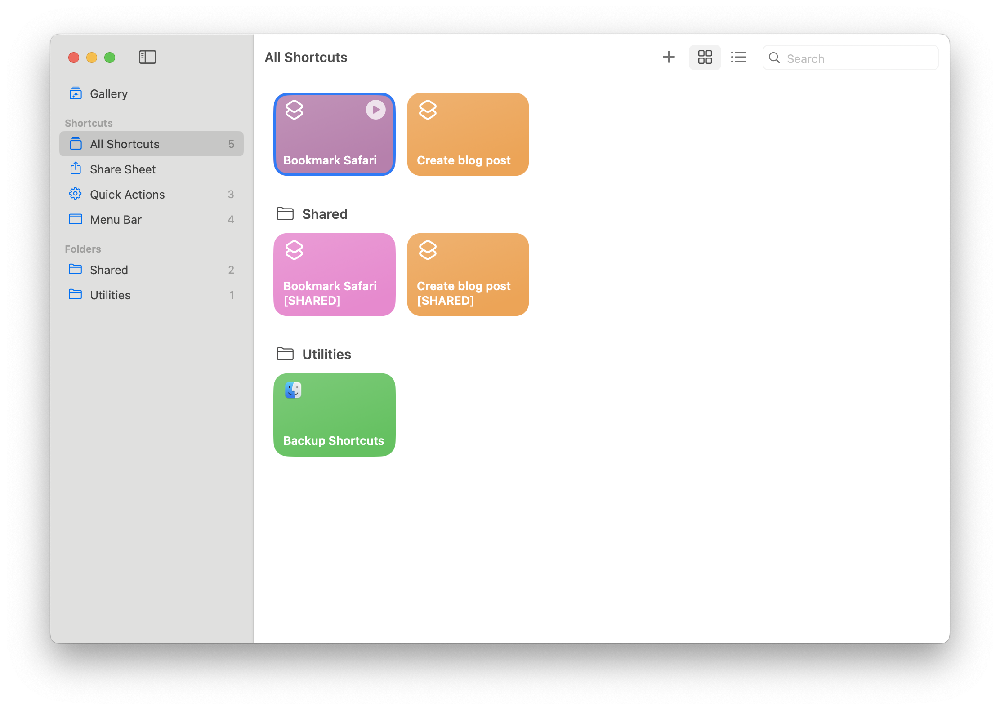

You need to right click and select "Rename":

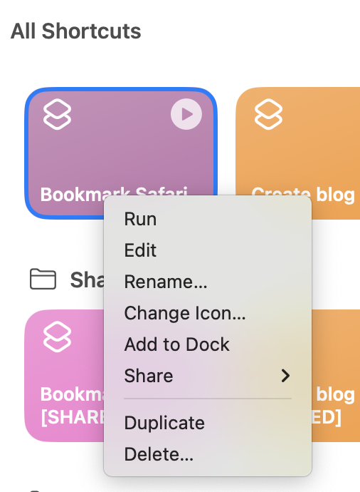

Seriously!?

But surely it works for the folder names on the right...Right? Surely? Nope. Right click and rename again.

(NOTE: Actually, you _can_ start a rename from clicking on it, but you need to click on the actual text. Clicking anywhere else in the horizontal bar does nothing.)

This amount of inconsistency and poor UI is very troubling from _Apple_: the epitome of good, or at least _considered and consistent_ design!

## Deletion has no undo

A more troubling issue is that deleting a Shortcut is immediately destructive. You cannot undo it and there isn't a holding bin (e.g. a "Trash" folder). It's gone. Kaput. **Immediately**.

And I have to point out - how do you delete a Shortcut? Highlight and press "Delete"? Of course not. Right click again... Sigh.

Maybe Apple need to put down the Apple sauce...

## Other issues

Extracting the URL from a Safari page is _a 5 step process_! Passing an object to the Alert action for debugging is pointless as it renders something completely different than using that same object elsewhere (e.g. passing the Safari web page/URL attribute to the Alert shows the URL. Passing the exact same thing to an Apple Note copies the _raw HMTL_!?)

There's no tags either, only folders. This will be a significant limitation (for me at least) for any non-trivial library.

## Summary

The potential here is huge. The execution is unfortunately pretty lacking. Some of the issues are almost certainly down to my lack of knowledge. But the UI inconsistencies? The lack of undo for deletion? That's definitely on them.

I'm excited to see where this in a year or so, but it definitely feels like this was released too soon. (I have exactly the same complaints about Apple Notes and Reminders BTW ;-)).

[Alfred](https://www.alfredapp.com)'s still pretty safe as the Leader of the Automation Tools (even if [Raycast](https://www.raycast.com) is nipping at their tail!)
