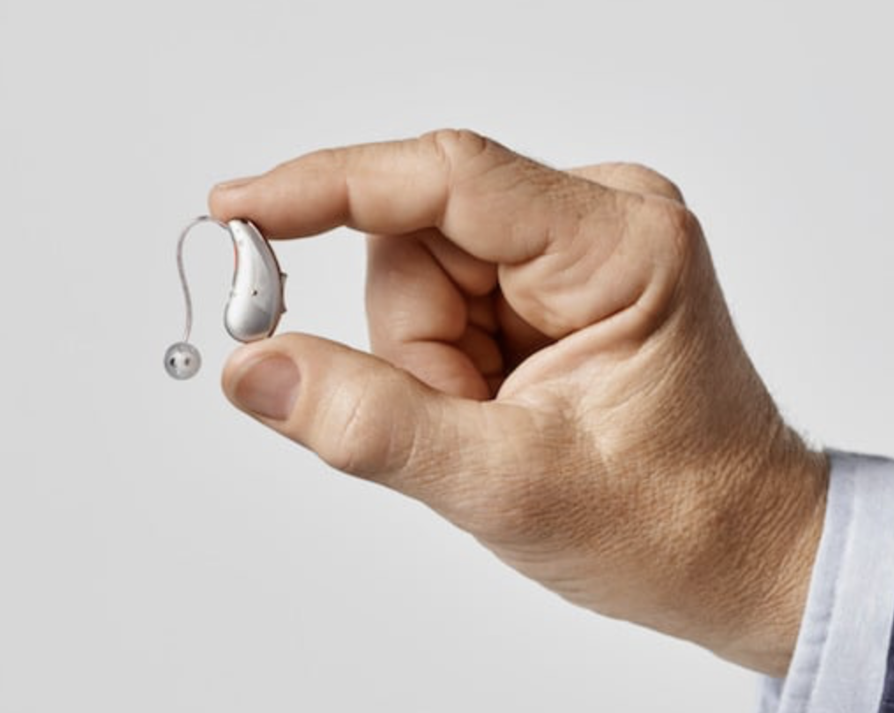

My hearing is pretty weird. 

An audiologist (from Specsavers) said I have excellent hearing up to a certain frequency and then it stops, like a cliff edge. No gentle gradual decrease, just really bad loss. What I _can_ hear I can hear very well. What I _can't_ hear I can't hear at all.

I can hear the bassy sounds but the "t"s, "h"s, and "s"s just don't register. If there are multiple sounds (people talking, music playing etc.) then I just hear mud and find it really hard and stressful to distinguish a single voice. It turns that high frequency sounds are very important for clarity! 

So anyways, after only a few weeks I got an NHS appointment with an audiologist who did their own tests and confirmed my weird hearing profile. 6 weeks or so later I got two very discrete "tear drop" things that fit behind the ear with a dangly bit that goes into the ear. I was astonished at how small and discrete they are. They were free (ok, we pay taxes etc.!) but retail for over £2K. Ongoing 2-week supplies of batteries are also free from the local doctor's reception.

(The following image (copied from [here](https://www.silversurfers.com/wp-content/uploads/2018/10/23856C1BTEaidheldbetweenthumbandforefingerRGB_5-1-1.jpg)) is _similar_ to mine but mine are even smaller)

Speaking of batteries. I tend to need to replace mine every 3 days to a week, but the hearing aids beep when they need replacing. The phone, if you decide to link them, reports the battery percentage and let's you do all sorts of other tricks if you want (playing music, adding white noise, noise cancellation etc.)

An important point is I never _noticed_ my hearing loss. The loss itself was gradual.

## A new world!

I kid you not. Using them for the first time was _intense_. It was as if a literal whole new world appeared. The best way you can emulate it is:

* put your hands over your ears so they are completely covered
* say "A B C D E F G H"
* now take your hands aware
* say "A B C D E F G H"

The difference was that stark.

By _intense_, I mean **intense**. It was emotional.

Being the numpty I am, I actually spent a bunch of time walking around the house wondering where that infernal ticking sound was coming from. It was the kitchen clock I could hear for the first time! 

The tap dripping was a symphony...until it became really annoying ;-).

## Range not volume

I was also surprised by _how_ they worked. They didn't necessarily make things _louder_, at least not that I can notice, they simply filled in the missing piece. Ok, yes, so they made the missing range louder, but doesn't seem like everybody is talking louder. I could still hear the kids mumbling "bye" as they walked out the door like before, but now I can actually associate that mumble with an real word rather than guessing.

## Outtake

I *strongly* recommend getting your ears tested. Opticians (in the UK) tend to do them for ~£10 and the result they gave me was near-identical to the NHS audiologist, which is confidence-inspiring.

Hearing loss can be gradual so you might not notice, and it makes *such* a difference. I'm still a grumpy old man approaching 50, but this removed a significant source of uneccessary stress.

As always, remember to please be kind to one another and yourself. Peace.
