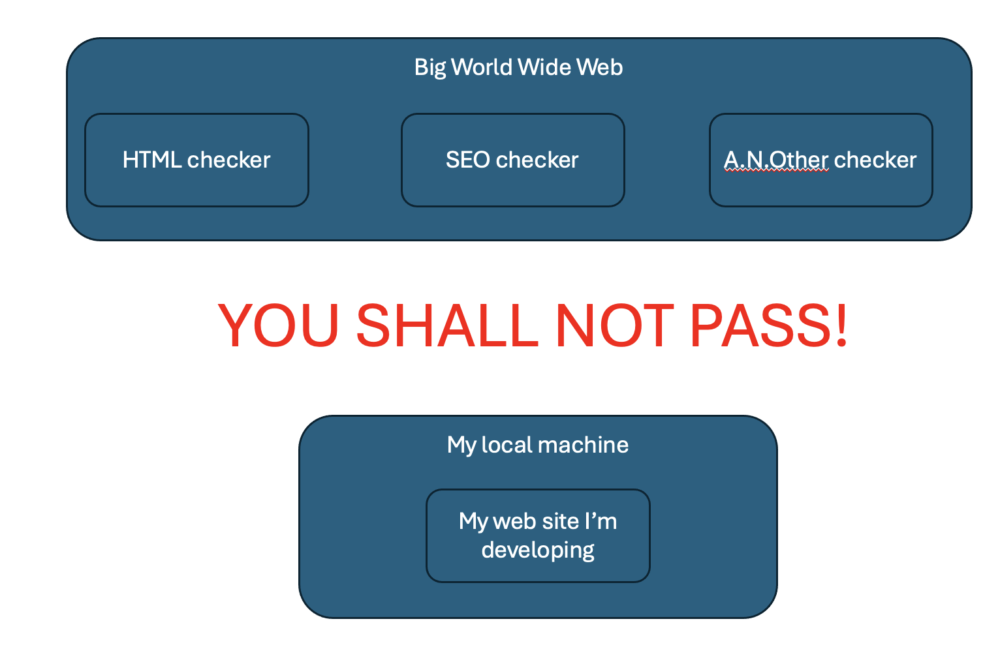
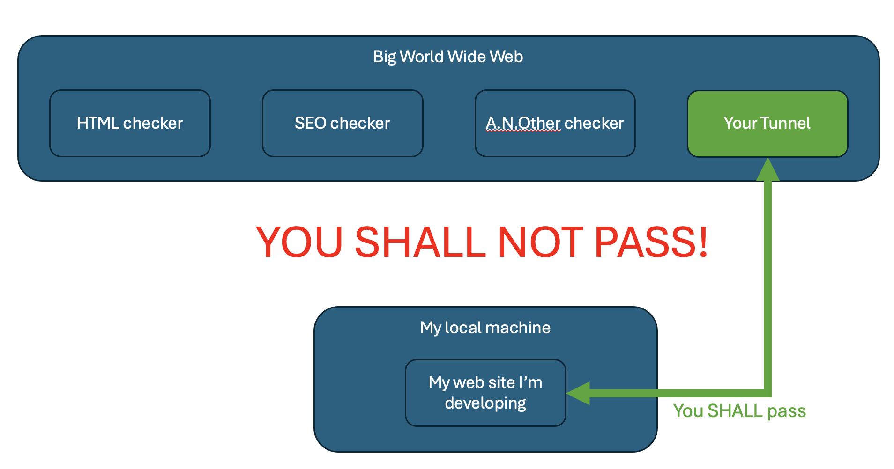
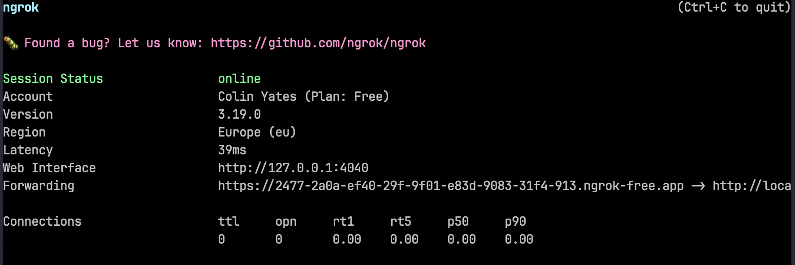
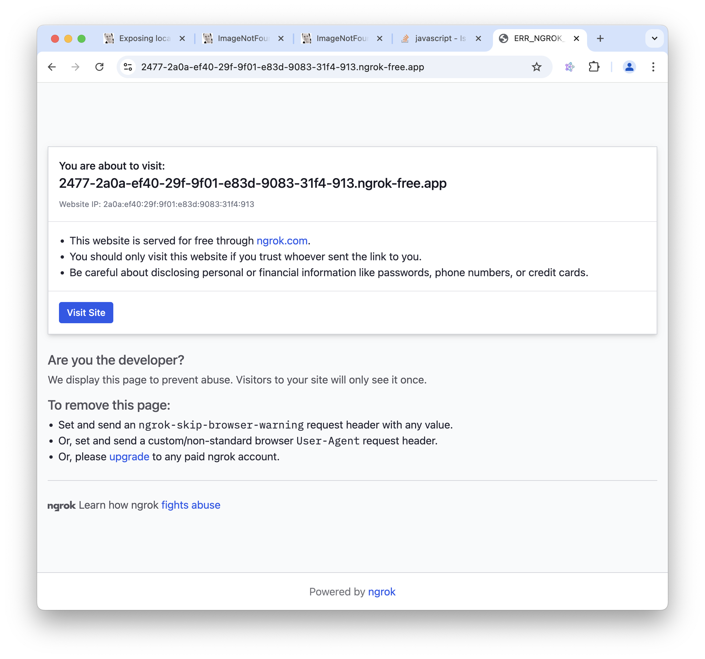
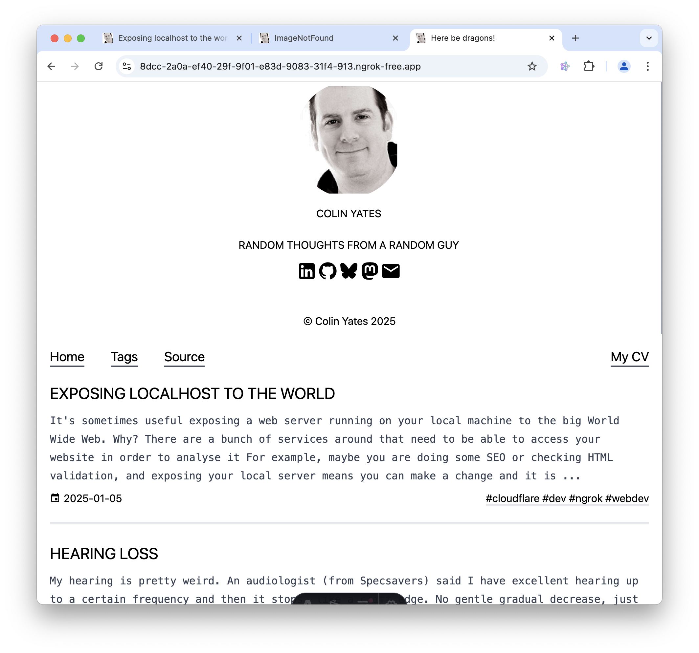
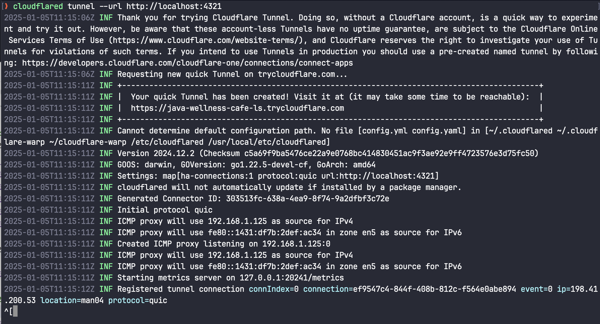
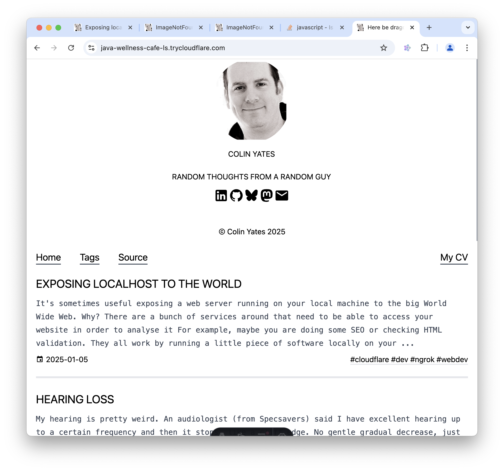
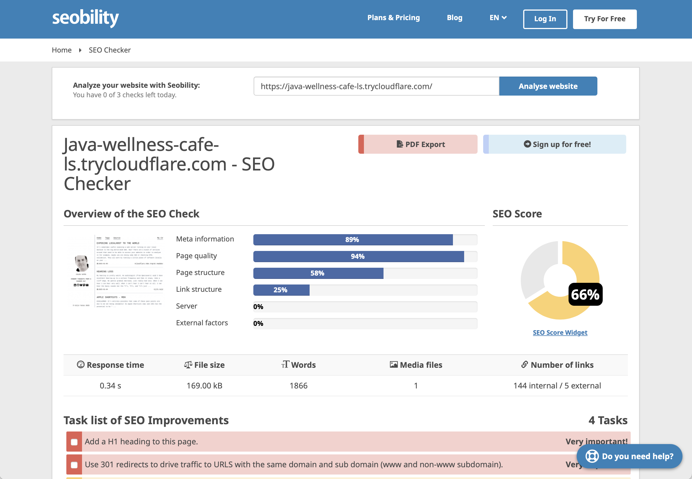

It's sometimes useful exposing a web server running on your local machine to the big World Wide Web. Why? There are a bunch of services around that need to be able to access your website in order to analyse it For example, maybe you are doing some SEO or checking HTML validation, and exposing your local server means you can make a change and it is instantly accessible.

However, the big World Wide Web can't see servers on your local machine. Here's a carefully crafted, highly technical image:



# Tunnels

[Tunnels](https://en.wikipedia.org/wiki/HTTP_tunnel) are fascinating little, but powerful, thing which "tunnel through" this restriction.

There are two ends to the tunnel, one end in the big World Wide Web and the other end on your local machine. Visiting the public one magically visits your local machine:



They all work by running a little piece of software locally on your machine which creates a tunnel from the big World Wide Web to a port on your local machine. Services can then visit the publically-accessible-website which is then served by your local machine. Wonderful. You can develop locally as normal and still run validation tools (etc.) against it.

# ngrok (the one the market suggests)

There are a number of solutions out there, and I often see [ngrok](https://ngrok.com) mentioned. It is indeed a _fine_ service, but it has two critical (for me) faults:

- the free version has a landing page
- the lowest paid tier is too expensive $10/month

## Usage

Creating a tunnel (once signed up) is trivial (`4321` is the port that my local server which serves the HTML is on):

```zsh
ngrok http 4321
```

This then creates the tunnel and gives you a nice shiny overview in your terminal:



This includes the randomly created publically-visible-URL, in this case: "https://2477-2a0a-ef40-29f-9f01-e83d-9083-31f4-913.ngrok-free.app".

Now the magic - you can open https://2477-2a0a-ef40-29f-9f01-e83d-9083-31f4-913.ngrok-free.app in your browser...

## Landing page

Except you don't get to see your page, you get this:



So all those lovely tools will also see this. There are ways to avoid this (as the page details) but they are either paid or not feasible. There isn't any way to circumvent this it seems.

Clicking the "Visit Site" button takes you through to your local site:



(how meta is that - you can see the preview of _this_ blog post in this image which is contained in this blog post which is a preview of _this_ blog...... Wow - mind blown ;-))

## Pricing

One way to avoid this is to pay. Unfortunately, the minimum payment is $10/month (https://ngrok.com/pricing), which is just too much.

I think this is a silly pricing model. There are two customers for this sort of service:

- the casual user who might use a few hundred requests a month
- big shops who might use millions of requests a month (and can afford more than $10 a month)

Making it free for the casual user is a very sensible thing to do because most casual users will be professional developers using this in their spare time, and most developers work with the tools they know so are likely to recommend this tool at work.

As it is, they've priced me (and I expect a bunch) of professional developers out for home use and therefore I won't be using them in my business.

Which is a shame, because they offer a really nice toolkit. Just not one that is worth $10/month to me.

# Cloudflare

If you aren't familiar with [Cloudflare](https://cloudflare.com) then stop reading and go and read up on everything they offer for free. It's _amazing_.

Included in this is an _anonymous_ (i.e. you don't need to sign up for Cloudflare!) tunnel called (unimaginatively) [Cloudflare Tunnel](https://developers.cloudflare.com/cloudflare-one/connections/connect-networks/).

This is a simple tool you run locally:

```zsh
cloudflared tunnel --url http://localhost:4321
```

which then shows you the local dashboard:



This also includes the randomly generated public URL (https://java-wellness-cafe-ls.trycloudflare.com) which when visited shows the actual site:



Neat huh!

No pesky landing page to get in the way.

## SEO as an example

So let's try one of those funky tools which analyse your tool. Let's see how my blog is doing on SEO using a random SEO checker https://www.seobility.net/en/. Pop in the public URL and let it work:



Awesome!

(NOTE: Well, "Awesome" in the sense it _worked_, but "oh, pants" in the sense my blog post needs a bunch of work for anyone to find it ;-))

Make a change locally to address the recommendations, re-run the SEO checker, and watch those reds and yellows change to green!

No extra deployment steps needed. Local change = public change.

# Outro

Developers often to expose their local servers to the world so they can iteratively develop locally whilst still accessing all the funky services offered in the big World Wide Web.

ngrok seems to be really popular but it has two fatal flaws for the casual user. Cloudflare's Tunnel is free, no pesky landing page, doesn't require signup and works perfectly well.

(Don't forget to shutdown your tunnel once you are finished with it ;-))
