I've been messing around with https://unraid.net again, trying to tidy up my data which was spread across multiple disks. This has led to a _bunch_ of interesting needs:
 - removing duplicates
 - finding series (Books, Music, Movies, TV) with missing items
 - storing TBs of data temporarily as I move it around

## Diversion
Regarding removing duplicates, there are paid software to do it, but I felt deep in my soul that a Linux-ish box should do this for free, and indeed it can. A quick search led me to this funky fragment from https://discussions.apple.com/thread/255589789?sortBy=rank:

```bash
find . -type f ! -empty -exec cksum {} + | sort | tee /tmp/f.tmp | cut -d ' ' -f 1,2 | uniq -d | grep -hif - /tmp/f.tmp
```

However, it took _a while_ (5 minutes I gave up)

## Another diversion

I also found https://zeroduplicates.com from https://www.reddit.com/r/macapps/comments/1hnq8z4/zero_duplicates_free_duplicate_file_finder/.

This looked promising! After a welcome screen telling you what to do:

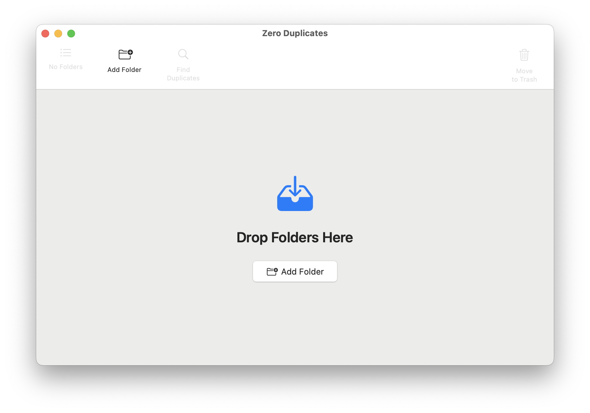
Drag and drop/add your folder:

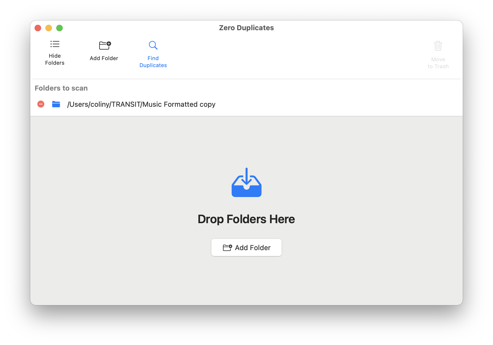
Click "Find Duplicates":

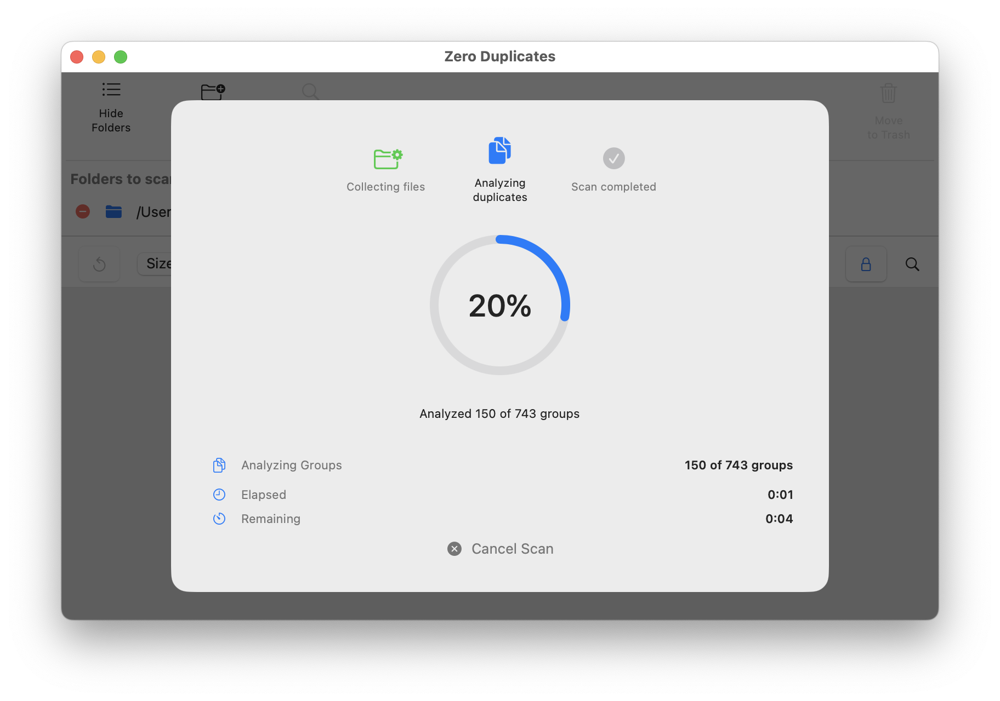
And it seems to have found all the duplicates:

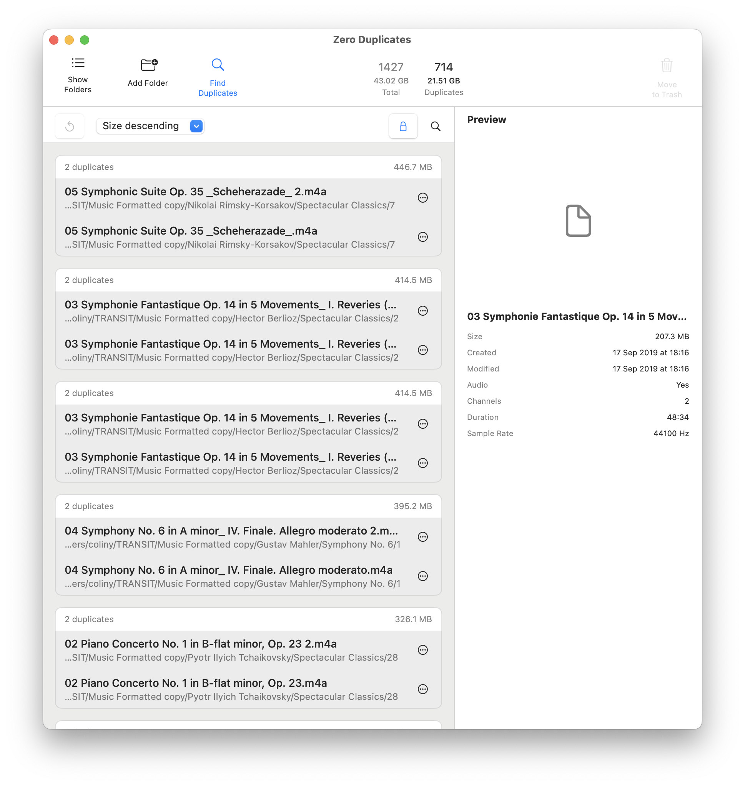
Of which there are...many - great!

Unfortunately, this is where it all fell down because it requires selecting each individual row, one by one. There is a clear and consistent pattern in the file name where the original is named `<original file.ext>` and the duplicate is named `<original file 2.ext>`, but there doesn't seem to be any way to tell the software that.

And there are *hundreds* to select. Moving on...

(at this point, I'm feeling pretty embarrassed about the fact that I've got over 30 years experience building software, but I really didn't fancy my chances script fiddling)

## The answer - dupeGuru

https://dupeguru.voltaicideas.net also came up during the search. It was Open Source and free, so worth a look. Starting it gives a pretty bare bones, but to the point UI:

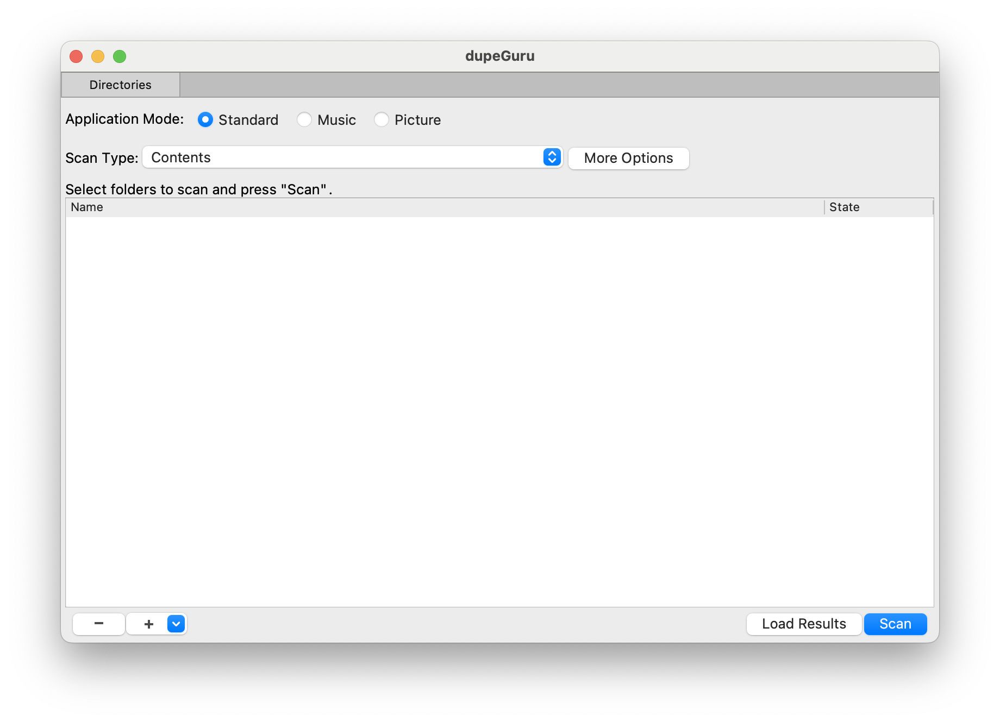
Great! "Application Mode" lets you give dupeGuru a significant hint as to the type of file, and "Scan Type", and "More Options" let you tweak it further. 

Te defaults were fine so I just added the folder:

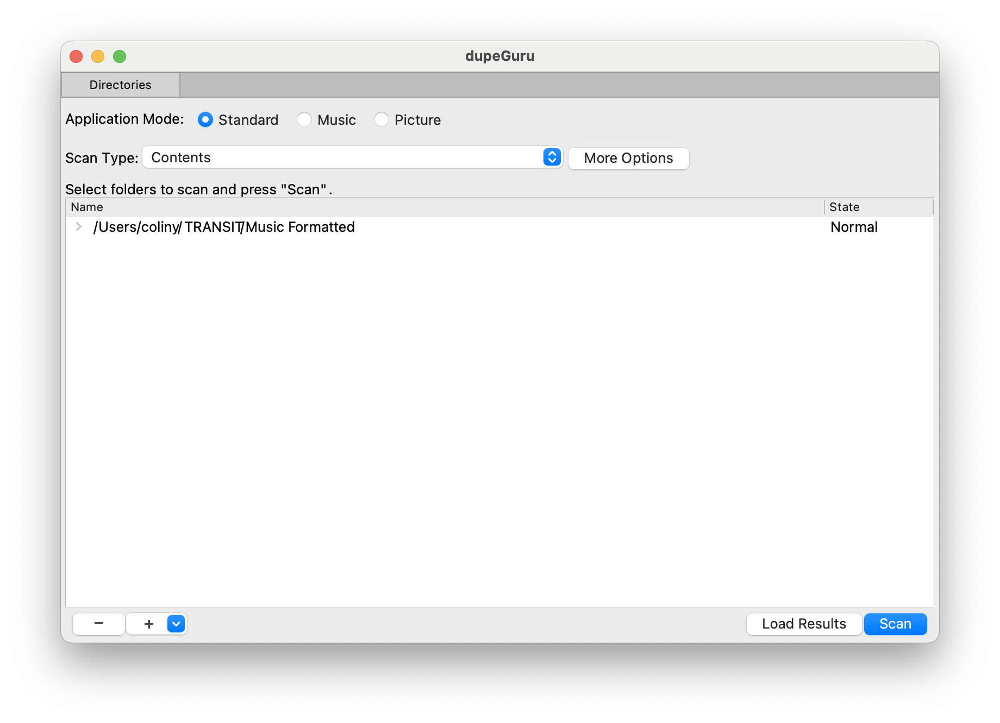
and clicked "Scan":

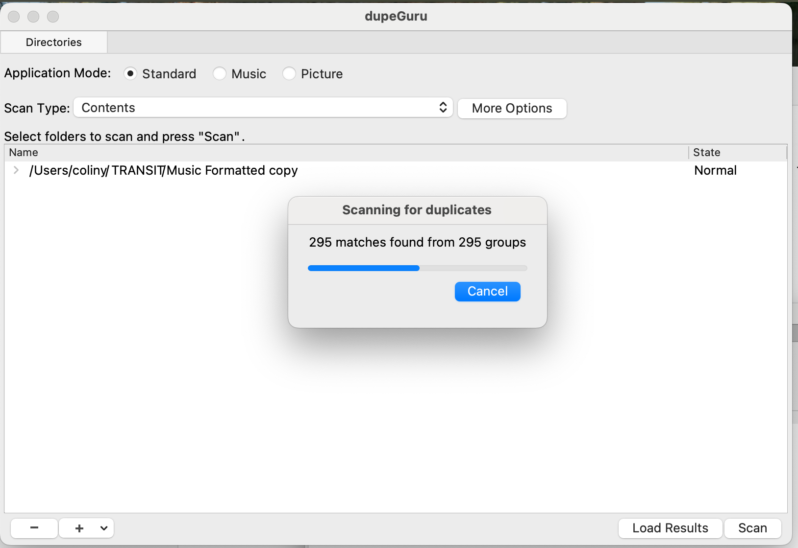

and yeah, after 10 seconds or so:

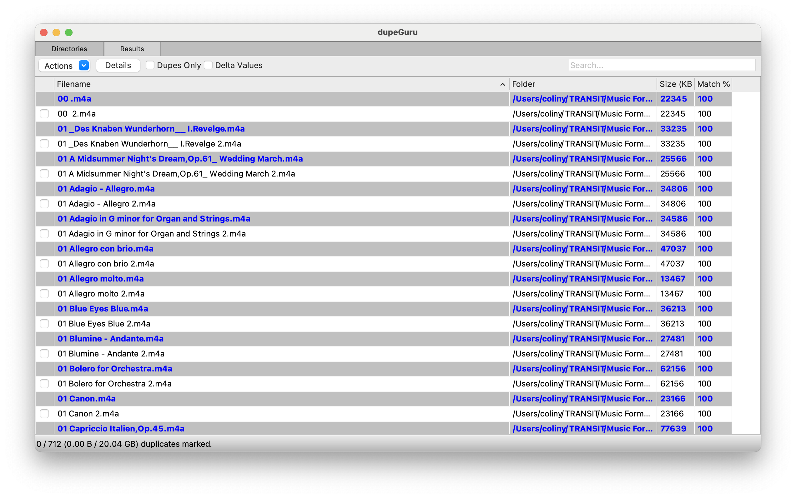
I was faced again with having to select each row. *Because* it defaulted to selecting the duplicate file `<original file 2.ext>` as the duplicate, I clicked "Dupes Only" which hid the original files:

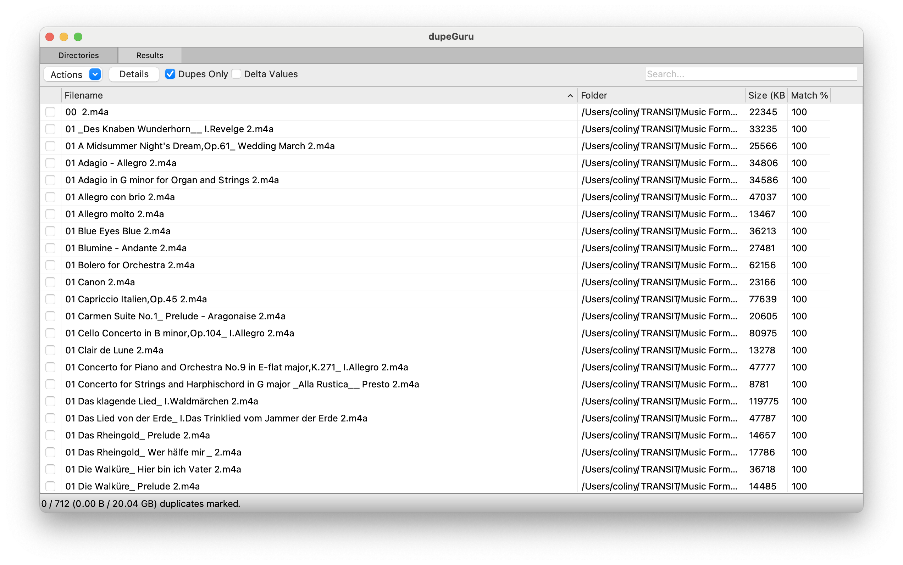
This meant I could right click in the tick box column and choose "Select All". Except I couldn't:

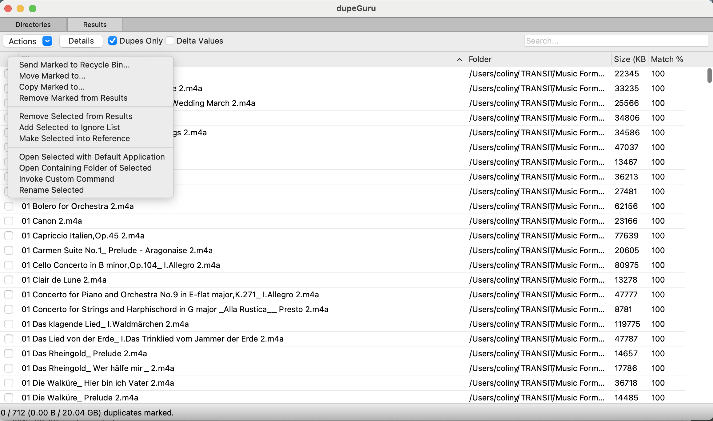

Gah! Thankfully, a desperate "throw spaghetti at the wall and see what sticks" reach for "Select All" (`<Command-A>`) actually ticked them too. I'm not sure I like that from a UI point of view, as _selecting_ a row shouldn't really _enable_ that row, but I digress:
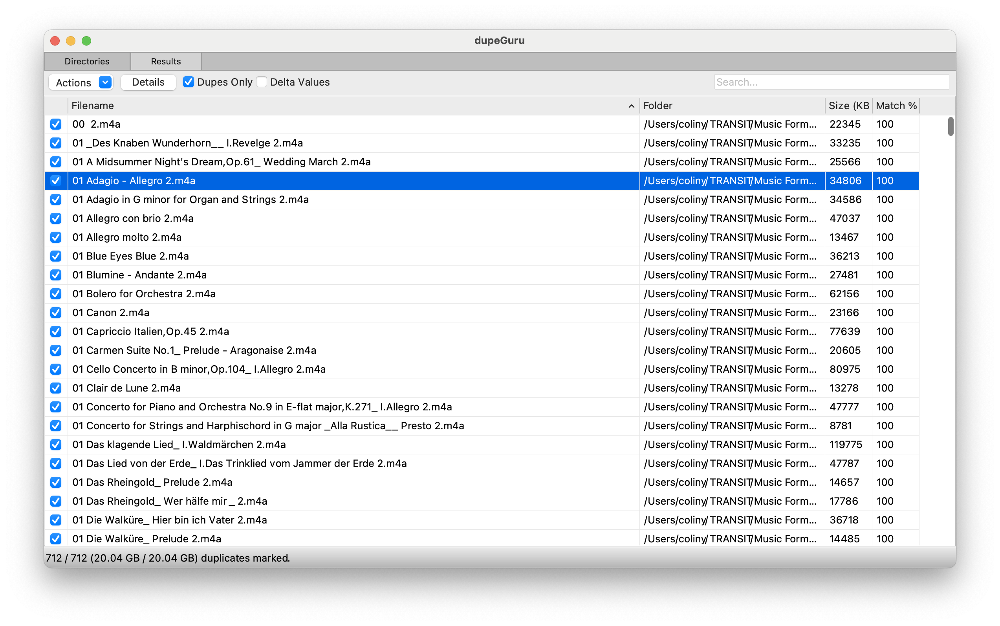
Now I could click on "Actions" (which gives the same menu as right clicking in the tick box column):

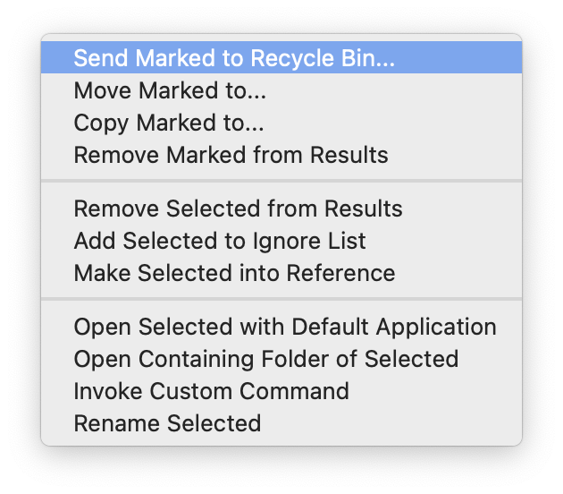
Choosing "Send Marked to Recycle Bin..." pops up another box:

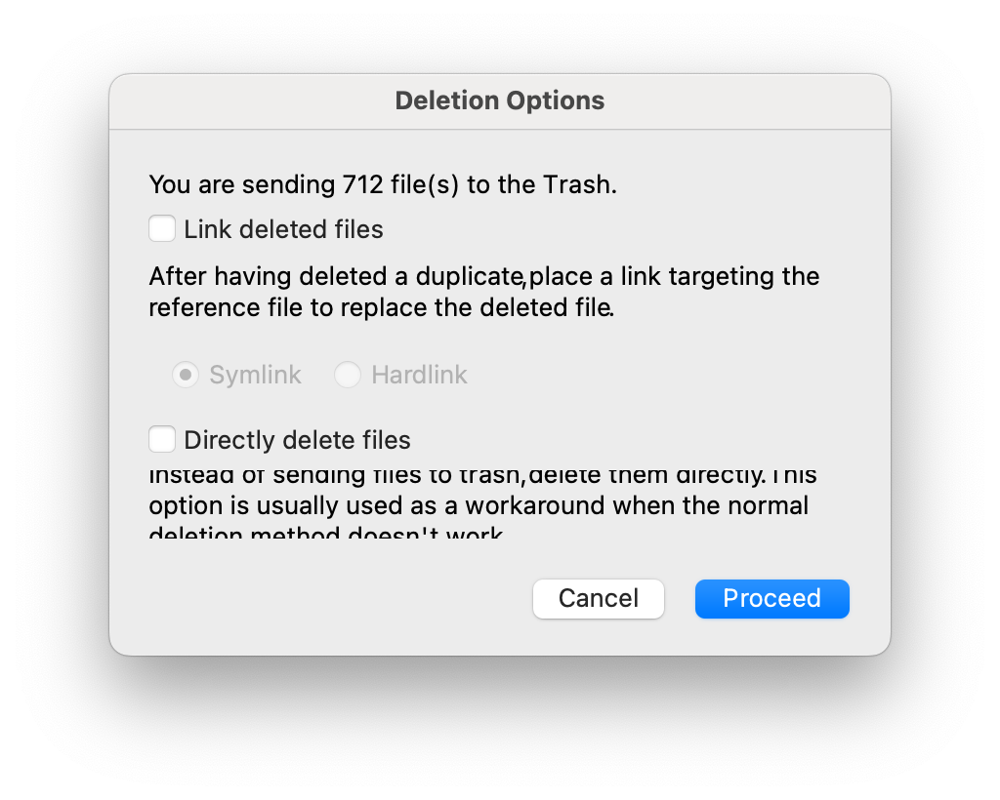
Clicking "Proceed" and off you go. 

Neat!