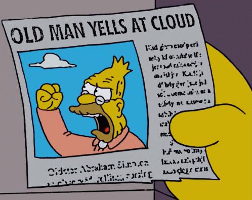

**THIS IS A DRAFT AND WILL CHANGE**

We're doing it wrong.

Kernel: who owns the decision

Well:
 - unbreakable lego bricks that enforce constraint

Badly:
 - overly controlling "mega methods" with 12 parameters

Ideal:
 - uncompromised lego bricks which provide no alternative
 - lego bricks can build walls
 - walls can also be built easily (but this isn't an _owning_ abstraction, it is convenience)
